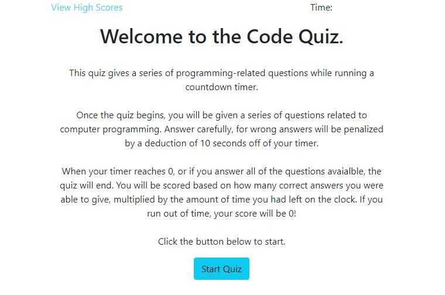
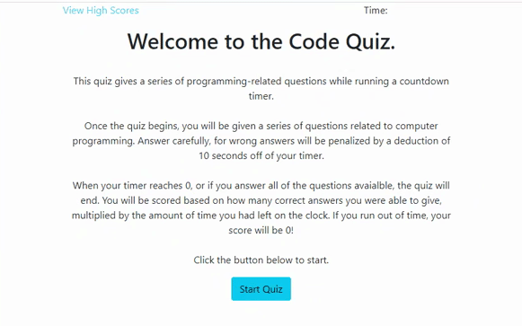
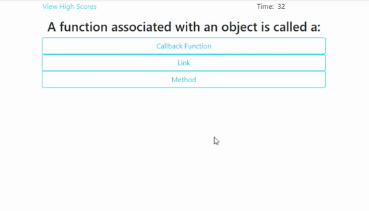
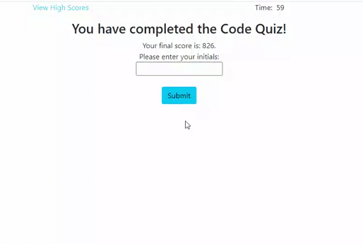

# Code Quiz

## Table-of-Contents

- [Description](#description)
- [Deployed Site](#deployed-site)
- [Features](#features)

- [Technologies](#technologies)
- [Future Development](#future-development)
- [Credits](#credits)

## Description

This application was created as a resource to students studying computer programming. Once launched, it navigates the user through a visually appealing coding quiz. It asks multiple choice questions about JavaScript, recording correct or incorrect answers and notifying the user if their choice was correct. This quiz includes a timer which counts down once the user starts the quiz. The timer decreases by ten questions for each incorrect response. Once the timer reaches zero, the quiz ends.

## Deployed Site

Follow [this link](https://ashlynn4567.github.io/Code-Quiz/) to view and use our site!

## Features

This is how the main page appears to users. The page is responsive, adapting to multiple screen sizes.

To begin the quiz, the user clicks on the "start" button. This dynamically hides the introduction section, while simultaneoulsy creates the question h2 elements and answer buttons. When the user selects an answer, they are given feedback in real time that tells them if they answered correctly or incorrectly.

Once the user has completed the quiz, they are presented with their score. They have the option to save their score. If they choose to save their score, their initials and score are saved to local storage. This feature persists even when the user refreshes the page.

If the user wishes to clear the high scores at any time, they are able to click the "clear highscores" button, which clears the local storage highscore data.

## Technologies

- HTML
- CSS
- JavaScript

## Future Development

In the future, I would like to add the following improvements:

- Clean up the appearance of the page with styling.
- Add a page that displays what the user answered vs the correct answers for each question.
- Add a functionality that allows users to add their own questions.
- Add a functionality that randomizes the question order.

I'm always interested in refactoring code to improve it's functionality. If you would like to suggest your own improvements, you can reach our development team at the links below.

- <a href="mailto:ashlynn4567@gmail.com">Email</a>
- <a href="https://github.com/ashlynn4567">GitHub</a>
- <a href="https://www.linkedin.com/in/ashley-lynn-smith/">LinkedIn</a>

## Credits

This project was built with the help of the University of Oregon's Coding Boot Camp.

## Licensing

The application is covered under the following license: [MIT](https://opensource.org/licenses/MIT)
